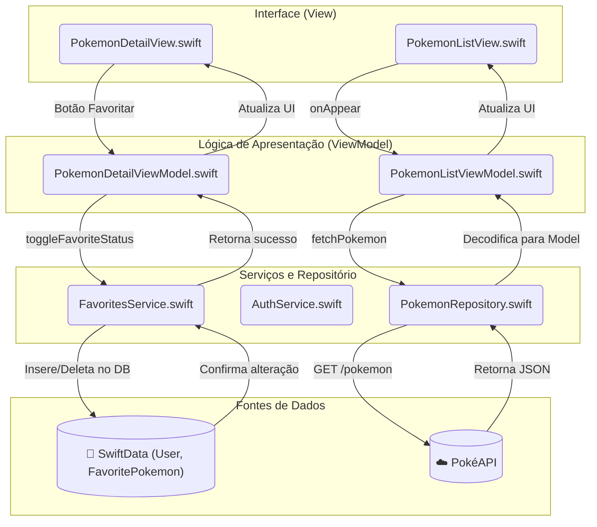

# PokéExplorer: Sua Jornada no Mundo Pokémon

### Autores

  * Gustavo Horning
  * Natan Batalha de Araújo
  * Ricardo Horning Hammerschmidt

## Descrição Geral do Aplicativo

O PokéExplorer é um aplicativo iOS desenvolvido em SwiftUI que funciona como uma Pokédex moderna e interativa. Ele permite que os usuários explorem o vasto universo Pokémon de maneira engajante e personalizada. As principais funcionalidades incluem:

  * **Autenticação de Usuários:** Sistema completo de cadastro e login para uma experiência personalizada.
  * **Exploração da Pokédex:** Uma lista infinita de Pokémon, carregada sob demanda para otimizar o desempenho.
  * **Detalhes Completos:** Visualização de informações detalhadas de cada Pokémon, incluindo atributos, habilidades e sprites em alta resolução.
  * **Coleção de Favoritos:** Os usuários podem marcar seus Pokémon preferidos, que ficam salvos em uma lista de favoritos vinculada à sua conta.
  * **Design Responsivo:** A interface se adapta de forma fluida a diferentes tamanhos de tela e orientações, oferecendo uma ótima experiência tanto em iPhones quanto em iPads.

## Escolha da API: PokéAPI

Para obter os dados dos Pokémon, o projeto utiliza a **[PokéAPI](https://pokeapi.co/)**.

### Justificativa da Escolha

A PokéAPI foi escolhida por ser a fonte de dados sobre Pokémon mais completa, gratuita e bem-documentada disponível. Ela oferece uma API RESTful de fácil consumo, não requer chave de autenticação para acesso público e possui uma vasta quantidade de informações, o que permitiu enriquecer o aplicativo com detalhes sem a necessidade de manter um banco de dados próprio.

### Como a API é Utilizada

A comunicação com a API é centralizada na classe `PokemonRepository`, que encapsula toda a lógica de rede. Os principais endpoints consumidos são:

  * **Lista de Pokémon:** `https://pokeapi.co/api/v2/pokemon?limit=20&offset=X`
      * Usado para carregar a lista de Pokémon de forma paginada. O `limit` define quantos vêm por vez e o `offset` controla qual "página" de resultados é buscada.
  * **Detalhes do Pokémon:** `https://pokeapi.co/api/v2/pokemon/{id}/`
      * Usado para buscar todos os dados de um Pokémon específico a partir de seu ID.

### Dados Utilizados

O aplicativo decodifica o JSON da API para os seguintes modelos `Codable` definidos em `Pokemon.swift`:

  * **Da lista:** `name`, `url` (para extrair o `id`).
  * **Dos detalhes:** `id`, `name`, `height`, `weight`, `sprites` (incluindo `official-artwork`), `types`, `abilities` e `moves`.

## Arquitetura do Aplicativo: MVVM

O projeto foi estruturado seguindo o padrão de arquitetura **Model-View-ViewModel (MVVM)**, com o acréscimo de camadas de Serviço e Repositório para uma melhor separação de responsabilidades.

  * **Model:** Representa os dados. Dividido em dois tipos:

      * **Modelos de API (`Pokemon.swift`):** Estruturas `Codable` que mapeiam as respostas da PokéAPI.
      * **Modelos de Domínio (`User.swift`, `FavoritePokemon.swift`):** Classes `@Model` do SwiftData que representam os dados persistidos localmente.

  * **View:** A camada de interface do usuário, construída com SwiftUI. As Views são reativas e "burras", apenas exibindo os dados fornecidos pelo ViewModel e encaminhando as interações do usuário. Ex: `PokemonListView.swift`, `PokemonDetailView.swift`.

  * **ViewModel:** O intermediário que conecta o Model e a View. Ele contém a lógica de apresentação e o estado da UI. Ex: `PokemonListViewModel`, `PokemonDetailViewModel`.

  * **Repository & Service:**

      * **Repository (`PokemonRepository.swift`):** Responsável exclusivamente pela comunicação com a API externa (PokéAPI).
      * **Services (`AuthService.swift`, `FavoritesService.swift`):** Contêm a lógica de negócios que interage com o banco de dados local (SwiftData), como registrar um usuário ou favoritar um Pokémon.

### Diagrama de Fluxo Detalhado



### Fluxo de Ação: Favoritar um Pokémon

A arquitetura do aplicativo garante que as responsabilidades sejam bem separadas. O fluxo para favoritar um Pokémon ilustra isso bem:

1.  **View (`PokemonDetailView`):** O usuário toca no botão de estrela. A `View` não sabe *como* favoritar; ela apenas notifica o ViewModel sobre a intenção do usuário, chamando a função `viewModel.toggleFavoriteStatus()`.
2.  **ViewModel (`PokemonDetailViewModel`):** Ao receber a chamada, o `ViewModel` orquestra a operação. Ele localiza o usuário logado e invoca o serviço apropriado: `FavoritesService.toggleFavorite(pokemon:, for:, context:)`.
3.  **Service (`FavoritesService`):** Esta camada contém a lógica de negócios. O serviço verifica se o Pokémon já é um favorito para aquele usuário. Se for, ele remove o objeto `FavoritePokemon`. Se não for, ele cria um novo objeto e o insere no `ModelContext`. Finalmente, ele chama `context.save()` para persistir as mudanças.
4.  **Atualização da UI:** Após o `Service` completar a operação, o `ViewModel` reavalia o estado (`isFavorite = FavoritesService.isFavorite(...)`) e atualiza sua propriedade `@Published var isFavorite`. Como a `View` está observando essa propriedade, ela se reconstrói automaticamente, fazendo com que o ícone da estrela mude de preenchido para vazio (ou vice-versa) com uma animação.

## Implementação do SwiftData

A persistência de dados local foi implementada utilizando **SwiftData**, o framework moderno da Apple para gerenciamento de dados.

### Modelo de Dados

Foram definidos dois modelos principais:

  * **`User`:** Armazena `username` (único) e `passwordHash`.
  * **`FavoritePokemon`:** Armazena os dados essenciais de um Pokémon favoritado (`pokemonID`, `name`, `imageURL`).

A relação entre eles é de um-para-muitos: um `User` pode ter muitos `FavoritePokemon`. Isso é definido com o macro `@Relationship(deleteRule: .cascade)`, que garante que os favoritos de um usuário sejam apagados caso a conta seja deletada.

### Salvando e Buscando Dados

  * **Inserção e Deleção:** Operações de escrita são gerenciadas pelos `Services`. Por exemplo, para favoritar um Pokémon, o `FavoritesService` cria uma instância de `FavoritePokemon`, a associa ao usuário e a insere no `ModelContext`, salvando as alterações em seguida.
  * **Busca:** A busca de dados é feita de duas formas:
    1.  **Programática:** Usando `context.fetch()` com um `FetchDescriptor` e um `#Predicate` para buscas específicas, como encontrar um usuário pelo nome.
    2.  **Reativa (na UI):** A `FavoritesListView` utiliza o property wrapper `@Query` para buscar e exibir uma lista de favoritos que se atualiza automaticamente sempre que o banco de dados muda.

### Implementação da Autenticação

O `AuthService` gerencia a autenticação.

  * **Cadastro:** Verifica se um `username` já existe. Se não, cria um novo objeto `User` e o salva no `ModelContext`.
  * **Login:** Busca um `User` pelo `username` fornecido. Se encontrado, compara o `passwordHash` do banco com o fornecido. Em caso de sucesso, a `LoginView` atualiza flags no `@AppStorage` para manter o usuário logado entre as sessões do aplicativo.

## Implementação dos Design Tokens

Para garantir consistência visual e facilitar a manutenção, o projeto utiliza um sistema de **Design Tokens**, centralizado no arquivo `DesignTokens.swift`.

### Definição

Os tokens foram definidos usando `enums` e `structs`, o que garante o reuso e previne o uso de valores "mágicos" (hard-coded) no código:

```swift
// Em DesignTokens.swift

// Cores
enum AppColor {
    static let primary = Color("Primary")
    static let background = Color("Background")
    // ...
}

// Fontes
enum AppFont {
    static func pokemonTitle(size: CGFloat = 28) -> Font {
        .system(size: size, weight: .bold, design: .rounded)
    }
    // ...
}

// Espaçamentos
struct AppSpacing {
    static let small: CGFloat = 8
    static let medium: CGFloat = 16
    // ...
}
```

### Uso

Esses tokens são referenciados em todas as Views. Por exemplo, na tela de detalhes:

```swift
// Em PokemonDetailView.swift
VStack(spacing: AppSpacing.medium) { // Uso de token de espaçamento
    Text(viewModel.pokemon.name.capitalized)
        .font(AppFont.pokemonTitle()) // Uso de token de fonte
    
    // ...
}
.padding()
.background(AppColor.surface) // Uso de token de cor
.cornerRadius(12)
```

Essa abordagem permite que uma mudança no `DesignTokens.swift` (ex: alterar a cor primária) seja refletida instantaneamente em todo o aplicativo.

## Implementação do Item de Criatividade: Paginação

O item de criatividade escolhido foi a **Paginação** na lista de Pokémon, implementada para criar uma experiência de "rolagem infinita". Isso melhora drasticamente o desempenho e a experiência do usuário, pois o aplicativo não tenta carregar todos os mais de 1000 Pokémon de uma só vez.

A implementação é dividida em três partes:

1.  **Repository (`PokemonRepository`):** A função `fetchPokemonList` foi projetada para aceitar parâmetros de `limit` e `offset`, permitindo que a API retorne os Pokémon em lotes.
2.  **ViewModel (`PokemonListViewModel`):** O ViewModel mantém o controle do `currentOffset` (quantos Pokémon já foram carregados). A função `loadMorePokemon()` é responsável por incrementar esse offset e chamar o repositório para buscar o próximo lote.
3.  **View (`PokemonListView`):** Na grade de Pokémon, o modificador `.onAppear` é aplicado a cada `PokemonCardView`. Dentro dele, há uma verificação para ver se o Pokémon que está aparecendo é o último da lista atual. Se for, a função `viewModel.loadMorePokemon()` é acionada, carregando os próximos 20 Pokémon de forma transparente para o usuário.

## Bibliotecas de Terceiros Utilizadas

Nenhuma biblioteca de terceiros foi utilizada. O projeto foi construído inteiramente com frameworks nativos da Apple, como **SwiftUI**, **SwiftData** e **Combine**.
